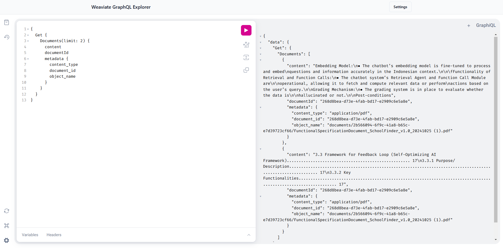

# Weaviate GraphiQL Explorer

A GraphiQL interface for exploring Weaviate GraphQL APIs.

## Screenshots

### Configuration Dialog


### GraphiQL Explorer Interface


## Features

- Secure API key authentication
- Full GraphiQL interface
- Schema exploration

## Getting Started

### Prerequisites

Make sure you have [bun](https://bun.sh/) or `node` installed on your system.


### Install dependencies:

```bash
bun install
```


### Development

To start the development server:

```bash
bun dev
```

Visit `http://localhost:5173` to see the app.

## Usage

1. When you first open the app, you'll see a configuration dialog
2. Enter your Weaviate instance details:
   - Endpoint URL (e.g., https://your-instance.weaviate.cloud)
   - API Key
3. Click "Connect to Weaviate" to validate your connection
4. Once connected, you can:
   - Write and execute GraphQL queries
   - Explore your schema
   - Use autocompletion
   - View query results
5. Click the "Settings" button in the top right to modify your connection details

## Example Queries

```graphql
# Get schema information
{
  __schema {
    types {
      name
      fields {
        name
      }
    }
  }
}

# Get inserted docs
{
  Get {
    Documents(limit: 2) {
      content
      documentId
      metadata {
        content_type
        document_id
        object_name
      }
    }
  }
}
```

## How to use query

Full docs: https://weaviate.io/developers/weaviate/api/graphql